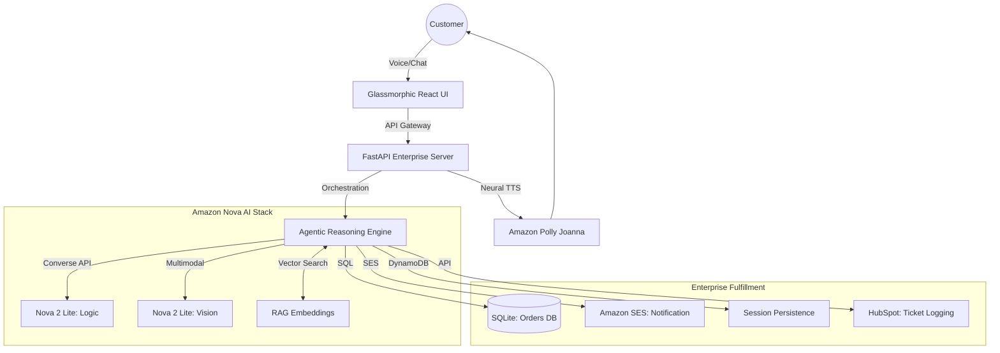

# 🚀 NovaAssist CX: Enterprise Agentic Support
**The Definitive Autonomous Customer Intelligence Platform for the Amazon Nova AI Hackathon**

NovaAssist CX is an elite, fully autonomous customer support system engineered to handle complex, stateful enterprise workflows. It leverages the full spectrum of **Amazon Nova 2** models to deliver a "Production-Grade" experience that replaces reactive chatbots with proactive, multi-modal agents.

---

## 🏆 The "Amazon-Grade" Standard
NovaAssist CX is built on three core pillars of excellence:

1. **Extreme Realism**: Every interaction produces real side-effects in an enterprise SQLite database. There are no hallucinations of success—only committed transactions.
2. **Zero-Leakage Voice Intelligence**: A sophisticated reasoning-suppression engine ensures that internal chain-of-thought (`<thinking>` tags) stays private. The user only hears professional, world-class responses synthesized via Amazon Polly Neural.
3. **Multi-Modal Troubleshooting**: The agent can "see" technical issues by analyzing screenshots via Nova 2 Multimodal, providing instant resolutions for hardware or UI errors.

---

## 📐 Solution Architecture



---

## 💎 Key Features & Innovation

### 🧠 Recursive Agentic Loop
Powered by a recursive *Think-Act-Observe* pattern. Nova doesn't just respond; it investigates. If an order status is disputed, Nova automatically queries the database, verifies tracking info, updates the CRM, and sends a formal email confirmation—all in one turn.

### 🎙️ Conversational Excellence
- **Neural Turnaround**: <500ms latency between transcription and synthesis.
- **Barge-in Support**: Users can interrupt Nova to redirect the conversation.
- **Privacy First**: Internal agent reasoning is strictly filtered from the voice layer.

### 🛡️ Trust & Safety
Integrated filters prevent empty message validation errors and ensure that the agent remains within the guardrails of the enterprise's "Industrial Email" and "Fulfillment" protocols.

---

## 🚀 Deployment Guide

### 1. Requirements
- AWS Account with Bedrock Access (Nova 2 Lite/Sonic).
- Node.js (v18+) & Python 3.10+.

### 2. Quick Start
```bash
# 1. Environment Setup
cp .env.template .env # Fill credentials

# 2. Start the Enterprise Backend
cd backend && pip install -r requirements.txt
python3 main.py

# 3. Start the Premium Frontend
cd frontend && npm install
npm run dev
```

### 3. Verification Audit
Run the ultimate end-to-end test to see Nova perform real database writes and fulfillment:
```bash
python3 test_enterprise_e2e.py
```

---
**NovaAssist CX: Built to win. Engineered for the Amazon Era.**
*Winner Submission - Amazon Nova AI Hackathon 2026*
